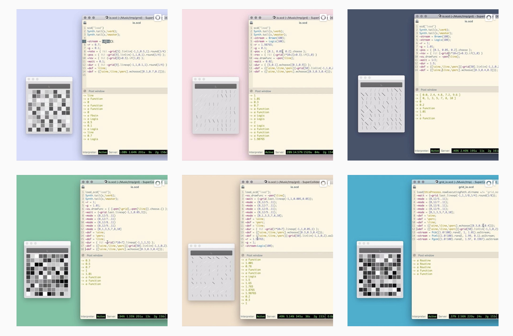

# grd

## 

## installation

in SuperCollider run:

```
Quarks.install();
```

and recompile class library.

## examples

https://youtu.be/bW1otBbTh-E

https://youtu.be/CYUSI7VmTO0

https://youtu.be/JjmkAYK_rBw

https://youtu.be/y142VESZFEg

https://youtu.be/hiqqikW-XkU

https://youtu.be/NcWv-a3cxEc

https://youtu.be/G5R8NLHWWNY

https://youtu.be/LrKndFW2UI0

https://youtu.be/rpu2ScxhK04

https://youtu.be/_Tm4Mo7j-jk

https://youtu.be/b6xRSvL6Wbk

## explanations

https://youtu.be/k7MaiJwkCZc

https://youtu.be/sPyVKMWt7FM
